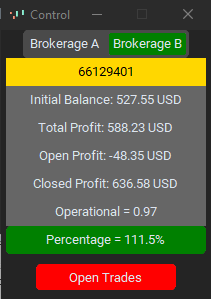
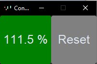

# Python MT5 Control Demo


Python MT5 Control Demo is a simple application built using Python and the MetaTrader 5 API (MetaTrader 5 is a trading platform). This application provides a graphical user interface (GUI) for monitoring trading operations, account balances, and profits for two different brokers. The GUI is created using the `customtkinter` library, and it allows users to switch between different modes to view relevant information.

## Features

- Display account information such as client ID, initial balance, total profit, open profit, closed profit, lots, and more.
- Switch between different brokers using a segmented button.
- Calculate and display profit percentages and commission based on trading activity.
- Show a table of open trading positions for each broker.
- Automatically update information at regular intervals.
- **Automatic Commission Calculation**: The program automatically calculates the commission for each closed operation based on the symbols traded and the configured commission multipliers in the config.ini file.
- **Box Mode:** This mode allows you to control your profit percentage from any point in time. By resetting the initial capital, you can track your profit percentage without considering the entire trading history. It's a useful tool for monitoring your trading performance with flexibility.
- **Automatic Daily Reset:** The program resets the initial capital every day if it's open. This ensures a more accurate calculation of the initial capital for tracking purposes. If the program is closed and reopened, it calculates the initial capital based on the previous day's total profit, providing you with precise tracking of your trading performance.
- **Open Source**: This program is open-source, allowing you to inspect, modify, and contribute to its development.

## Usage

1. Launch the program using the command mentioned below.
2. Switch between brokers using the "Brokerage A" and "Brokerage B" buttons.
3. Monitor your account's equity, profit, and other relevant information.
4. Utilize "Box Mode" to monitor profit percentages and reset initial capital.

    

5. The program will automatically reset your initial capital daily if it's open.

## Requirements

- Python 3.x
- MetaTrader 5 platform
- `customtkinter` library
- `MetaTrader5` library
- `pandas` library
- `configparser` library
- `schedule` library

## Installation

1. Install the required Python libraries:

   ```bash
   pip install customtkinter MetaTrader5 pandas configparser schedule
2. Clone or download the repositoy
   ```bash
   git clone https://github.com/BryanIlha/Python-MT5-Control-Demo.git
3. Create a 'config.ini' file:
You need to create a config.ini file in the project directory. The file should have the following format:

    ```bash
    [brokerages]
    brokerage a = path_to_terminal.exe
    brokerage b = path_to_terminal.exe

    [multiplier_brokerage_a]
    EURUSD = 0.1
    GBPUSD = 0.15
    # Add more symbols and multipliers as needed

    [multiplier_brokerage_b]
    EURUSD = 0.2
    GBPUSD = 0.25
    # Add more symbols and multipliers as needed
4. Run the program:
    ```bash
    python main.py
Please Note:
- This program is currently in a demo version and is under development. As such, there might be some inaccuracies in profit calculations, particularly when dealing with trades that were executed on previous days or trades that were left open overnight.
